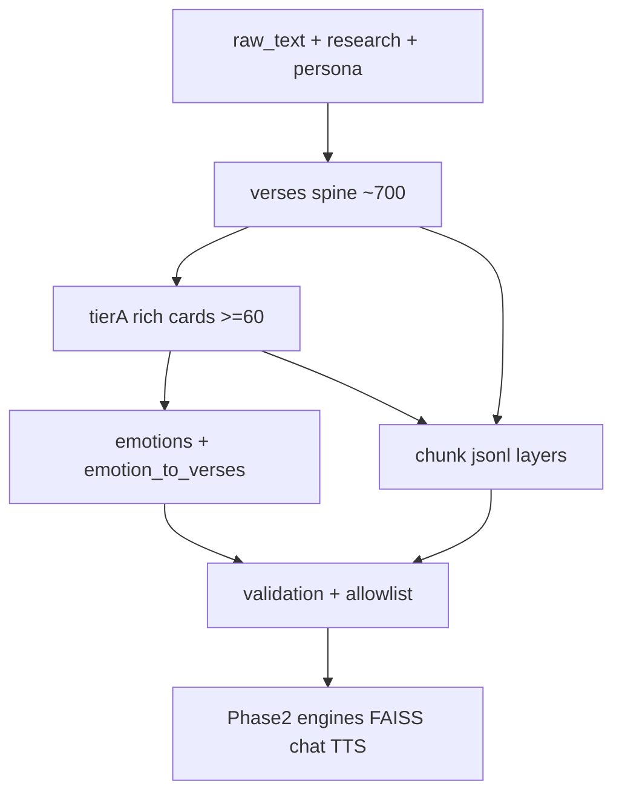

# Phase 1 — Knowledge Base Plan (Detailed)

**Scope:** Phase 1 only. Build a **product-grade V1 knowledge base** under `knowledge/` so every teaching citation is real, retrieval is hybrid (emotion tags + semantic chunks), and Phase 2 engines load files without improvisation.  
**Outcome:** `verses.json` (full spine ~700 + rich tier-A ≥60), emotion/situation taxonomy, FAISS-ready chunks, citation allowlist, validation reports.  
**Not in this phase:** FastAPI/Next.js, Supabase auth wiring, Kokoro-FastAPI client, full 500-emotion ontology, LoRA fine-tune, perfect ~40-book library polish.

**Depends on:** Phase 0 persona package ([phase-0-persona-plan.md](phase-0-persona-plan.md), [prompts/system_v1.txt](../prompts/system_v1.txt)).  
**Persona constraints (non-negotiable):** real `BG_x_y` only; nimitta not God; multi-tradition on contested; crisis paths do not teach or dump verses ([behaviour_matrix.md](v1/persona/behaviour_matrix.md)).

**Prereq done before this plan:** Hindi sources OCRd into `knowledge/raw_text/` (Yatharupa + `bhagavad-gita-hindi`); English Gita extracts already present; env keys for later phases live in `.env` (not used here).

---

## 1. Purpose and success criteria

Phase 1 exists so the companion can go:

```text
struggle heard → emotion/situation mapped → real verse + strategy
```

without inventing scripture or improvising retrieval.

| Success criterion | How we know |
|-------------------|-------------|
| Every teaching citation is in the KB | `citation_allowlist.txt` = spine IDs; gen may not invent |
| Someone in fear / grief / shame gets a defensible primary verse | `emotion_to_verses.json` covers behaviour-matrix situations |
| Hybrid retrieval possible | Tag search + embeddable chunks ready |
| Hindi not an empty promise | Tier-A has `translations.hi` **or** explicit gap |
| Zero silent stubs on tier-A | Validation: missing required fields = 0 for `quality: tier_a` |
| Engines know paths | §10 Phase 2 handoff lists exact files |

North star (unchanged): someone at 2am feels heard **and** receives path with exact chapter and verse.

---

## 2. What “detailed enough for V1” means (not basic)

| Layer | V1 must ship | Deferred post-V1 |
|-------|--------------|------------------|
| All ~700 Gita verses | Structured cards: EN translation required, IAST/Devanagari when available, chapter metadata | Perfect multi-commentary on every verse |
| **Rich teaching set** | **≥60 tier-A** fully tagged (emotions, situations, strategy, depth, readiness, secondary verses) | 500-emotion ontology |
| Emotion map | **Operational taxonomy ~40–80 states** → primary + 1–2 secondary verses | Plutchik × Nāṭyaśāstra mega-graph |
| Commentaries | Quartet-style on **tier-A / contested** from **books we have** | Full classical corpora for all 700 |
| Hindi | HI on **tier-A** from OCR/text sources when quality holds; else gap list | Full HI polish + re-OCR |
| Conversations | Keepers + Phase 0 examples tagged for chunks | 50 perfect dialogues |
| Books | Chunked, sourced, indexable layers | ~40-book ideal library |
| Safety | `crisis_forbidden` + allowlist; `do_not_use_when` | E2E encryption profiles |

**Default rigor:** complete **spine** for all 700 (citation never fails open with fake IDs) + **tier-A quality first** for teaching depth.

---

## 3. Current inventory (inputs)

### 3.1 Raw text (primary Gita / knowledge books)

Under [knowledge/raw_text/](../knowledge/raw_text/) (see [knowledge/sources/manifest.json](../knowledge/sources/manifest.json)):

| Kind | Example files | Phase 1 role |
|------|---------------|--------------|
| EN Gita + commentary | `Bhagavad_Gita_-_The_Song_of_God_-_Swami_Mukundananda.txt` | **Preferred default EN** spine translations |
| EN Gita + purports | `Bhagavad-gita-As-It-Is.txt` | Tradition `prabhupada`; secondary EN |
| Studies / other EN | `A-Study-of-the-Bhagavadgita.txt`, `Teachings_of_the_Bhagavadgita.txt`, `The_Bhagavad_Gita.txt`, `bhagavadgitabook00judg.txt`, ch. focus books | Commentary / chunk layers |
| HI Gita (OCR) | `Bhagavad-gita_As_It_Is_by_A_C_Bhaktivedanta_Swami_Prabhupada_in_Hindi_Bhagavad-gita_Yatharupa_1980.txt`, `bhagavad-gita-hindi.txt` | Tier-A `translations.hi` + hi commentary |
| Narrative / Krishna | `Krishna_Book.txt`, `mahabharataofkri12roypuoft.txt`, philosophy titles | Context chunks only — **never** fake `BG_*` |
| Hindi literary | `Bhagvan-Sri-Krishn23102025120.txt` | Extra HI context; not verse spine truth |

Scripts: [scripts/extract_pdfs.py](../scripts/extract_pdfs.py), [scripts/ocr_fast.py](../scripts/ocr_fast.py).

### 3.2 Research & persona

| Path | Use |
|------|-----|
| [knowledge/research/01](../knowledge/research/01) | Ethics, crisis, multilingual, disclosure |
| [knowledge/research/02](../knowledge/research/02) | Detection-first, anchor verses, appraisal, Gita map |
| [docs/v1/persona/](v1/persona/) | Behaviour matrix, examples, spine — taxonomy must align |
| [docs/v1/persona/examples/](v1/persona/examples/) | Few-shot patterns for conversation chunks |
| [knowledge/Krishna_Conversations/](../knowledge/Krishna_Conversations/) | Keepers (01, 03 present; add any restored keepers) |

### 3.3 Gaps to track (not blockers)

| Gap | V1 handling |
|-----|-------------|
| OCR noise in HI | Prefer Yatharupa for ISKcon-style HI; hand-check tier-A; mark `quality` gaps |
| Incomplete classical quartet | Use available: Mukundananda + Prabhupada + study notes; set `contested: true` + `pluralism_note` when schools diverge and sources thin |
| Thin conversation folder | Rely on Phase 0 examples + existing keepers |
| Structured `knowledge/gita/` | **Does not exist yet** — create in this phase |

---

## 4. Target directory tree

```text
knowledge/
  gita/
    verses.json                 # array or { "verses": [...] } of all ~700 cards
    verses_by_chapter/          # optional BG_01.json … BG_18.json for git diffs
    anchor_verse_ids.json       # ordered tier-A priority list (≥60 IDs)
    traditions_map.json         # source file → tradition key
  taxonomy/
    emotions_v1.json
    situations_v1.json
    emotion_to_verses.json
    crisis_forbidden.json
  chunks/
    gita_verse_chunks.jsonl
    book_chunks.jsonl
    conversation_chunks.jsonl
  indices/
    README.md                   # how to rebuild FAISS (implement end Phase 1 or start Phase 2)
    # faiss.index + id_map.json when built
  sources/
    manifest.json               # extend with tradition tags where useful
  validation/
    checklist.md
    missing_fields_report.md    # generated by validator script
    citation_allowlist.txt      # one BG_x_y per line
    sample_retrieval.md         # 10 user-feelings → expected primary IDs
  raw_text/                     # already exists
  research/                     # already exists
  Krishna_Conversations/        # already exists

docs/
  phase-1-knowledge-plan.md     # this file
  v1/knowledge/                 # optional field guide once built (SCHEMA quick ref)
    README.md                   # short “how to read verses.json” for engineers
```

Do **not** commit large FAISS binaries if oversized; document rebuild in `indices/README.md`.

---

## 5. Verse ID and chapter conventions

### 5.1 ID format

```text
BG_{chapter}_{verse}
```

Examples: `BG_2_47`, `BG_18_66`, `BG_2_62`, `BG_2_63` (pair verses stay separate cards; tag linkage in `secondary_verses`).

### 5.2 Spoken / written citation product form

From persona: **chapter and verse** in speech (“Bhagavad Gita chapter 2, verse 47”). Internal system and logs always use `BG_2_47`.

### 5.3 Chapter verse counts (spine completeness check)

Use a single counting convention (product default: common critical edition counts). Validator must assert **exact expected total** for chapters 1–18.

| Ch | Verses | Ch | Verses |
|----|--------|----|--------|
| 1 | 47 | 10 | 42 |
| 2 | 72 | 11 | 55 |
| 3 | 43 | 12 | 20 |
| 4 | 42 | 13 | 35 |
| 5 | 29 | 14 | 27 |
| 6 | 47 | 15 | 20 |
| 7 | 30 | 16 | 24 |
| 8 | 28 | 17 | 28 |
| 9 | 34 | 18 | 78 |

**Expected spine size:** **700** cards (if a source edition differs on ch.13, document in `verses.json` metadata `counting_convention` and keep IDs stable once chosen).

---

## 6. Verse card schema (canonical)

Every card is one JSON object. Extend product shape from [krishna-ai-full-product-doc.md](../krishna-ai-full-product-doc.md) §8.

### 6.1 Required by quality tier

| Field | `spine` | `tier_a` | Notes |
|-------|---------|----------|--------|
| `id`, `chapter`, `verse` | yes | yes | |
| `translations.en` | yes | yes | Non-empty string |
| `sanskrit_devanagari` / `iast` | if available | prefer both | May empty on spine if extract fails — flag in validation |
| `translations.hi` | optional | required-or-gap | If missing on tier-A: list in HI gap report |
| `quality` | `spine` | `tier_a` | |
| `emotions`, `situations` | empty ok | ≥1 each | |
| `response_strategy`, `readiness`, `depth_level` | optional | required | |
| `secondary_verses` | optional | ≥1 recommended | |
| `commentaries` | optional | ≥1 tradition preferred | |
| `sources` | ≥1 when machine-filled | ≥1 | file + approximate page/marker |
| `do_not_use_when` | optional | set when crisis-sensitive | |

### 6.2 Full example (`tier_a`)

```json
{
  "id": "BG_2_47",
  "chapter": 2,
  "verse": 47,
  "section_title": "Karma-yoga — right to action, not to fruit",
  "sanskrit_devanagari": "कर्मण्येवाधिकारस्ते मा फलेषु कदाचन। …",
  "iast": "karmaṇy evādhikāras te mā phaleṣu kadācana …",
  "translations": {
    "en": "You have a right to action alone, never to its fruits…",
    "en_by_source": {
      "mukundananda": "…",
      "prabhupada": "…"
    },
    "hi": "…",
    "hi_by_source": {
      "prabhupada_hi": "…"
    }
  },
  "commentaries": {
    "mukundananda": "Short extract…",
    "prabhupada": "Short extract…",
    "study": "Optional academic note…"
  },
  "contested": false,
  "pluralism_note": null,
  "emotions": ["fear_of_outcome", "control_anxiety", "paralysis_from_results"],
  "situations": ["fear_outcome", "duty_paralysis", "attachment_to_result"],
  "intensity_range": [3, 9],
  "tone": "instructive_firm",
  "response_strategy": "reframe control: action vs fruit; return agency",
  "readiness": "teach_ok",
  "depth_level": 1,
  "secondary_verses": ["BG_2_48", "BG_3_19"],
  "sample_follow_up": "What outcome are you treating as the only proof you are enough?",
  "sources": [
    {
      "file": "knowledge/raw_text/Bhagavad_Gita_-_The_Song_of_God_-_Swami_Mukundananda.txt",
      "locator": "chapter 2 verse 47 vicinity"
    }
  ],
  "quality": "tier_a",
  "do_not_use_when": ["acute_suicidality", "crisis_l2_plus"]
}
```

### 6.3 Enums

**`readiness`:** `listen_first` | `teach_ok` | `crisis_never`  
**`depth_level`:** `1` foundational → `4` multi-verse synthesis  
**`quality`:** `tier_a` | `spine` | `stub` (stubs must not ship in V1 spine; prefer empty fields over fake text)  
**`tone`:** e.g. `gentle`, `instructive_firm`, `steady_calm`, `practical_duty` — align with sakha/guru/sarathi delivery, not divinity.

### 6.4 Safety fields

`do_not_use_when` values include at least:

- `acute_suicidality`
- `crisis_l2_plus`
- `active_self_harm_planning`
- `psychosis_or_incapacity` (teaching freeze; human help)

Any verse with `readiness: crisis_never` must never appear in teaching paths for crisis engines.

---

## 7. Build order (inside Phase 1)

Execute in order; do not jump to FAISS before spine + allowlist.

```text
1. traditions_map.json
2. Spine: import IDs + EN for all 700 → verses.json
3. citation_allowlist.txt from spine
4. anchor_verse_ids.json (tier-A list ≥60)
5. Upgrade tier-A cards (text + strategy fields)
6. taxonomy emotions + situations + emotion_to_verses
7. crisis_forbidden.json
8. Commentaries pass on tier-A
9. Hindi pass on tier-A
10. Chunks jsonl (verse, book, conversation)
11. Validation scripts + reports + sample_retrieval.md
12. indices/README.md (+ optional FAISS build)
```

### 7.1 Spine import (automation preferred)

**Default EN source:** Mukundananda raw text.  
**Fallback order:** As It Is → Judge/The Bhagavad Gita → other EN.

Tasks:

1. Parse or semi-manually fill chapter/verse boundaries.  
2. Create all IDs for §5.3.  
3. Attach best EN translation string.  
4. Set `quality: "spine"`.  
5. Leave emotion fields empty unless cheap keyword seed (prefer leave empty).

### 7.2 Tier-A upgrade (high human judgment)

Research anchors first ([knowledge/research/02](../knowledge/research/02)), then expand to ≥60 (full priority list in §8).

For each tier-A ID:

1. Confirm / clean EN.  
2. Tag emotions + situations.  
3. Strategy, readiness, depth, secondary, sample_follow_up.  
4. Commentary extracts (2–4 sentences max per tradition — for retrieval, not full book paste).  
5. HI if recoverable.  
6. Set `quality: "tier_a"`.

---

## 8. Tier-A anchor list (priority order)

Minimum **60** distinct verse IDs. First block = research anchors; remaining = high-traffic teaching / persona examples / chapter balance.

### 8.1 Research core (annotate first)

| ID | Teaching use (short) |
|----|----------------------|
| `BG_2_14` | Impermanence of sensations |
| `BG_2_20` | Eternal self — grief/death (delayed, not bypass) |
| `BG_2_47` | Right to action, not fruit |
| `BG_2_48` | Equanimity / yoga |
| `BG_2_62` | Contemplation → attachment chain |
| `BG_2_63` | Anger → destruction chain |
| `BG_3_27` | Guṇas / not sole doer |
| `BG_4_7` | Dharma declines — meaning despair (careful) |
| `BG_4_8` | With 4.7 pair |
| `BG_6_5` | Lift/self by self — shame vs agency |
| `BG_6_34` | Restless mind |
| `BG_6_35` | Abhyāsa + vairāgya |
| `BG_9_22` | Care for those who connect (loneliness, after listen) |
| `BG_9_34` | Orient mind toward divine (if invited) |
| `BG_10_20` | Presence in the heart (careful, not impersonation) |
| `BG_11_33` | Instrument / nimitta frame for user **and** AI humility |
| `BG_12_13` | Devotee qualities — friendliness |
| `BG_12_14` | Continues |
| `BG_18_58` | Grace / fortitude themes (not magic fix) |
| `BG_18_66` | Surrender carefully — never crisis dump |

### 8.2 Expand to ≥60 (recommended pack)

Include (all as separate tier-A candidates):

```text
BG_1_47, BG_2_7, BG_2_11, BG_2_13, BG_2_14, BG_2_15, BG_2_20, BG_2_22,
BG_2_27, BG_2_38, BG_2_40, BG_2_47, BG_2_48, BG_2_50, BG_2_55, BG_2_56,
BG_2_62, BG_2_63, BG_2_64, BG_2_66, BG_2_71,
BG_3_8, BG_3_19, BG_3_27, BG_3_35, BG_3_37, BG_3_42,
BG_4_7, BG_4_8, BG_4_18, BG_4_38,
BG_5_10, BG_5_22, BG_5_29,
BG_6_5, BG_6_6, BG_6_16, BG_6_17, BG_6_26, BG_6_34, BG_6_35,
BG_7_14, BG_7_19,
BG_8_7, BG_9_14, BG_9_22, BG_9_27, BG_9_34,
BG_10_20, BG_11_33, BG_11_55,
BG_12_13, BG_12_14, BG_12_15, BG_12_16,
BG_13_8, BG_14_22, BG_15_7, BG_16_1, BG_16_21,
BG_17_3, BG_18_48, BG_18_58, BG_18_63, BG_18_66, BG_18_78
```

Store ordered list in `knowledge/gita/anchor_verse_ids.json`:

```json
{
  "version": 1,
  "min_count": 60,
  "ids": ["BG_2_47", "BG_2_48", "…"]
}
```

If count slips under 60 in first pass, do **not** mark Phase 1 complete.

---

## 9. Emotion and situation taxonomy (V1)

Not 500 states. **Operational set ~40–80**, grounded in [behaviour_matrix.md](v1/persona/behaviour_matrix.md) + research/02 (shame vs guilt, appraisal, crisis).

### 9.1 `emotions_v1.json` shape

```json
{
  "version": 1,
  "emotions": [
    {
      "id": "fear_of_outcome",
      "label": "Fear of future result",
      "definition": "Anxiety that self-worth depends on controlled outcomes",
      "intensity_cues": ["what if", "ruined if", future panic language],
      "primary_verse": "BG_2_47",
      "secondary_verses": ["BG_2_48", "BG_2_50"],
      "crisis_override": null,
      "behaviour_matrix_row": "Fear (outcome, future)"
    }
  ]
}
```

`crisis_override: "block_teaching"` for L1 dump risks; for L2–L4 emotions map to **null** teaching always.

### 9.2 Minimum emotion IDs to cover matrix + product

| emotion_id | Primary verse (default) | Notes |
|------------|-------------------------|--------|
| `fear_of_outcome` | BG_2_47 | |
| `control_anxiety` | BG_2_47 | |
| `overwhelm` | BG_2_48 | |
| `grief_loss` | BG_2_11 / delay BG_2_20 | listen_first |
| `existential_terror` | BG_2_20 | not first-line in acute shock |
| `anger_boundary` | BG_2_62 | validate first |
| `anger_reactivity` | BG_2_63 | |
| `arrogance_ego` | BG_3_27 | |
| `confusion_paralysis` | BG_2_47 | + duty |
| `duty_conflict` | BG_3_35 | careful framing |
| `loneliness` | BG_9_22 | after heard |
| `shame_identity` | BG_6_5 | split from guilt |
| `guilt_event` | BG_2_40 | repair, not identity crush |
| `failure_narrative` | BG_6_5 | |
| `doubt_in_god` | null first | teach only if invited |
| `anger_at_god` | null first | |
| `curiosity_philosophy` | variable | free cite when not distress |
| `exhaustion_l1` | null teaching | crisis L1 |
| `hopelessness_l1` | null teaching | |
| `attachment_to_result` | BG_2_47 | |
| `desire_craving` | BG_3_37 | |
| `restless_mind` | BG_6_34 | |
| `scattered_attention` | BG_6_35 | |
| `self_hatred` | BG_6_5 | crisis check first |
| `despair_meaning` | BG_4_7 careful | not crisis path |
| `caregiver_fatigue` | BG_9_22 | |
| `envy` | BG_12_13–14 frame | |
| `moral_confusion` | BG_16_21 / BG_2_7 | |
| `spiritual_bypass_risk` | null | redirect to concretes |
| `devotional_longing` | BG_9_34 | user-led only |
| `fear_of_death` | BG_2_20 / BG_2_27 | readiness |
| `anxiety_performance` | BG_2_48 | |
| `indecision` | BG_18_63 | |
| `dependence_on_approval` | BG_6_5 | |
| `revenge_drive` | no revenge theology | agency reframe |
| `burnout_duty` | BG_3_8 / BG_2_47 | |
| `gratitude` | BG_9_27 | light |
| `awe` | careful Ch11 | no impersonation |
| `faith_wavering` | BG_17_3 | gentle |
| `temptation_gates` | BG_16_21 | |

Expand freely within 40–80 total; every ID must appear in `emotion_to_verses.json`.

### 9.3 `situations_v1.json`

Mirror behaviour matrix rows:

```text
fear_outcome, arrogance, grief_loss, confusion_paralysis, anger,
curiosity, loneliness_night, failure_shame, doubt_angry_god,
crisis_l1, crisis_l2_l4
```

Each situation maps → default mode (S/G/R/C), question count rule, verse timing, forbidden moves (copy from matrix for engine config).

### 9.4 `emotion_to_verses.json`

```json
{
  "fear_of_outcome": {
    "primary": "BG_2_47",
    "secondary": ["BG_2_48", "BG_3_19"],
    "teach_gate": "after_two_questions"
  },
  "crisis_l1_hopeless": {
    "primary": null,
    "secondary": [],
    "teach_gate": "never"
  }
}
```

**Done when:** every behaviour-matrix situation has a default mapping and crisis rows have `primary: null`.

### 9.5 `crisis_forbidden.json`

```json
{
  "levels": {
    "L1": {
      "allow_soft_grounding": true,
      "allow_gita_teaching": false,
      "allow_cite_for_comfort_dump": false
    },
    "L2": { "allow_gita_teaching": false },
    "L3": { "allow_gita_teaching": false, "helplines_only": true },
    "L4": { "allow_gita_teaching": false, "helplines_only": true }
  },
  "never_cite_when": [
    "active_plan",
    "means_and_intent",
    "goodbye_finality_language"
  ],
  "helpline_refs": "docs / system prompt — iCall, AASRA, Samaritans, 988 as geography-appropriate"
}
```

---

## 10. Chunking and RAG readiness

### 10.1 Verse layer — `gita_verse_chunks.jsonl`

One JSON object per line:

```json
{
  "chunk_id": "verse:BG_2_47",
  "verse_id": "BG_2_47",
  "layer": "verse",
  "embed_text": "BG 2.47 … EN translation … emotions: fear_of_outcome … strategy: …",
  "weight": 1.0
}
```

`embed_text` includes translation + emotion labels + short strategy (not full multi-thousand-char commentary).

### 10.2 Book layer — `book_chunks.jsonl`

| Param | Value |
|-------|--------|
| Target tokens | ~300–600 |
| Overlap | ~50–80 tokens or 1 paragraph |
| Fields | `chunk_id`, `source_file`, `tradition`, `text`, `linked_verse_ids[]`, `weight` |

**Weights:**

| Content | weight |
|---------|--------|
| Gita verse-aligned commentary | 1.0 |
| Philosophical study | 0.7 |
| Narrative Mahabharata / leela | 0.4 |
| OCR noisy HI | 0.6 max until cleaned |

`linked_verse_ids` only when confidently parsed; else `[]`. Never invent BG IDs.

### 10.3 Conversation layer — `conversation_chunks.jsonl`

Sources: Phase 0 examples + keepers.

```json
{
  "chunk_id": "conv:examples/01_hard_truth",
  "pattern": "hard_truth_after_listen",
  "text": "…",
  "verse_ids_mentioned": ["BG_2_47"],
  "weight": 0.8
}
```

### 10.4 FAISS build spec (`knowledge/indices/README.md`)

Define before coding so Phase 2 never improvises:

| Item | V1 default |
|------|------------|
| Embedding model | `sentence-transformers` e.g. `all-MiniLM-L6-v2` (EN-first; upgrade multilingual later if HI retrieval weak) |
| Index type | FAISS `IndexFlatIP` or IVF only if scale forces |
| Input | all three jsonl layers (filter by weight ≥ 0.4) |
| Outputs | `indices/faiss.index`, `indices/id_map.json` |
| Rebuild command | e.g. `python scripts/build_faiss.py` (create in Phase 1 end or Phase 2 start) |
| Ignore | raw private keys; `.env` |

Citation filter always: recovered `verse_id` ∈ allowlist.

---

## 11. Source / tradition policy

### 11.1 `traditions_map.json`

Map every primary raw file to a tradition key:

| Key | Role | Example file |
|-----|------|----------------|
| `mukundananda` | Default EN translation/commentary | Mukundananda Gita |
| `prabhupada` | EN purports | As It Is |
| `prabhupada_hi` | HI OCR | Yatharupa |
| `hi_misc` | Other HI OCR | bhagavad-gita-hindi |
| `study` | Academic / study | A-Study, Teachings |
| `narrative` | Story / Mahabharata | Krishna_Book, mahabharata |
| `philosophy` | Modern philosophy-of-Krishna | Krishna Man and Philosophy |
| `unknown` | Unclassified | set until tagged |

### 11.2 Contested theology

If Advaita vs Dvaita vs Gauḍīya readings conflict and we lack all classical sources:

1. Set `contested: true`.  
2. Short `pluralism_note` (1–2 sentences).  
3. Persona uses plural language; never “only my school is God.”

### 11.3 Licence / product use

- Private product corpus.  
- Internal citations point to `knowledge/raw_text/...`.  
- Do not paste long purports into public marketing without rights review.  
- OCR errors: prefer shorter verified extracts over long noisy pages.

---

## 12. Workstreams and checklist

| Stream | Deliverables | Done when |
|--------|--------------|-----------|
| **A. Spine** | `verses.json` ~700, allowlist | All ch 1–18 IDs; every card has non-empty `translations.en` |
| **B. Tier-A** | ≥60 rich cards | Fields in §6 for each `quality: tier_a` |
| **C. Taxonomy** | emotions, situations, emotion_to_verses, crisis_forbidden | Full matrix coverage |
| **D. Chunks** | three jsonl files | Counts logged; sample lines valid JSON |
| **E. Hindi** | tier-A HI / gap list | Gap report transparent |
| **F. Validation** | reports + 20-card human spot check | Zero fake IDs; tier-A field complete |
| **G. Handoff** | §13 paths stable | Phase 2 can start without re-deciding |

### 12.1 Human vs machine

| Work | Who |
|------|-----|
| Chapter/verse structure extract | Script + spot fix |
| Allowlist / schema validation | Script |
| Chunking | Script |
| FAISS build | Script |
| Emotion/strategy on tier-A | **Human / high-judgment agent pass** |
| Contested notes | Human review |
| HI quality on tier-A | Human sample + fix |
| sample_retrieval.md | Human |

---

## 13. Validation gates

### 13.1 Automated (script targets)

Propose `scripts/validate_kb.py` (implement during Phase 1):

1. Spine count = 700 (or declared convention).  
2. Every spine `translations.en` non-empty.  
3. `citation_allowlist.txt` IDs = set of `verses.json` IDs.  
4. Every `anchor_verse_ids` id exists and `quality == tier_a`.  
5. `len(tier_a) >= 60`.  
6. Every `emotion_to_verses.primary` is null or in allowlist.  
7. No secondary verse orphan.  
8. Crisis emotions/situations never point to teaching primary.  
9. JSONL lines parse.  

Emit `knowledge/validation/missing_fields_report.md`.

### 13.2 Human

- [ ] Spot-check **20** random tier-A cards for sense of EN, strategy, citation honesty.  
- [ ] Spot-check **10** HI fields against OCR (if present).  
- [ ] Confirm `sample_retrieval.md` 10 scenarios match product judgment.  
- [ ] Persona eval still holds (Phase 0): no “I am the Lord” examples introduced in knowledge text.

### 13.3 Sample retrieval table (template for `sample_retrieval.md`)

| User feeling | Expected primary `BG_*` | Notes |
|--------------|-------------------------|--------|
| Fear of result / exam / job | `BG_2_47` | After listen |
| Spiral of anger | `BG_2_62` / `BG_2_63` | After heat validated |
| “I am a failure” | `BG_6_5` | Shame/guilt split |
| Night loneliness | `BG_9_22` | Only after presence |
| Restless mind | `BG_6_34` | |
| Grief of death | sit first → optional `BG_2_11`/`BG_2_20` | |
| “Just give success verse” | brief check → `BG_2_47` hard | no charm |
| Angry at God | null teaching first | |
| Crisis L1 tired | null | helplines option |
| Duty confusion | `BG_3_35` careful | after clarity |

---

## 14. Explicit non-goals (Phase 1)

- Rewriting persona constitution (Phase 0 locked except one-line knowledge-path note if needed).  
- Next.js UI, soft auth, PostHog events.  
- Kokoro voice bake-off (see [docs/v1/voice/kokoro_fastapi.md](v1/voice/kokoro_fastapi.md)).  
- Fine-tune LoRA / Colab.  
- Full 500+ emotion ontology.  
- Perfect classical commentary on all 700.  
- Replacing English spine with OCR-only HI as sole truth.  
- Public open vector DB SaaS (keep FAISS local).

---

## 15. Handoff to Phase 2

When Phase 1 acceptance gates pass (§16):

1. **Load** `knowledge/gita/verses.json` + taxonomy files.  
2. **Retrieve** hybrid: emotion tags → candidates; FAISS/chunks → semantic support; rank; history filter (runtime).  
3. **Citation filter:** only allowlist IDs may appear as teaching citations.  
4. **Engines:** Crisis → Emotion → Appraisal lite → 3-act → Gita mapper → load [prompts/system_v1.txt](../prompts/system_v1.txt) → generate → no-claims / citation check.  
5. **Chat API** + run [docs/v1/persona/eval_prompts.md](v1/persona/eval_prompts.md) offline then live.  
6. **TTS:** Kokoro-FastAPI (`KOKORO_BASE_URL`) for speech of final text — not of inventory.  



**Phase 2 must not:** invent verse IDs, teach in L2–L4 crisis, treat AI as Krishna, or skip nimitta disclosure rules.

---

## 16. Acceptance gates (Phase 1 complete)

- [ ] `knowledge/gita/verses.json` exists with complete spine + **≥60** `tier_a` cards  
- [ ] `knowledge/gita/anchor_verse_ids.json` ≥60 and matches tier-A  
- [ ] `knowledge/gita/traditions_map.json` exists  
- [ ] `knowledge/taxonomy/emotions_v1.json` + `situations_v1.json` + `emotion_to_verses.json` + `crisis_forbidden.json`  
- [ ] `emotion_to_verses` covers all V1 situations in the behaviour matrix  
- [ ] `knowledge/validation/citation_allowlist.txt` matches spine IDs exactly  
- [ ] Validation report: missing required fields = 0 for tier-A; spine missing EN = 0  
- [ ] Chunks: three jsonl present with documented line counts in `indices/README.md` or checklist  
- [ ] `knowledge/validation/sample_retrieval.md` filled (10 scenarios)  
- [ ] `knowledge/validation/checklist.md` all major boxes ticked  
- [ ] Phase 0 constitution unchanged except optional one-line knowledge path note  

---

## 17. Implementation checklist (execution order)

Use this as the day-to-day task list when *building* (not just planning):

1. [ ] Create folders under `knowledge/gita|taxonomy|chunks|indices|validation`  
2. [ ] Write `traditions_map.json`  
3. [ ] Generate spine `verses.json` + allowlist  
4. [ ] Commit `anchor_verse_ids.json` (full ≥60 list)  
5. [ ] Upgrade all anchors to tier-A  
6. [ ] Fill taxonomy files  
7. [ ] Crisis forbidden config  
8. [ ] Commentary + HI passes tier-A  
9. [ ] Run chunk builders  
10. [ ] Run `validate_kb` (+ fix until green)  
11. [ ] Human 20-card spot check + sample_retrieval  
12. [ ] Write `indices/README.md`  
13. [ ] Optional: build first FAISS  
14. [ ] Open Phase 2  

---

## 18. Working principles (from Phase 0, applied to data)

1. **Nimitta, not divinity** — knowledge describes teaching; never “Krishna speaking through this card as the Lord.”  
2. **Straight hard truth** lives in `response_strategy` + example dialogues — not only soft translations.  
3. **Cite exact chapter and verse** — allowlist only.  
4. **Questions before philosophy** — encoded in `readiness` / teach_gate, not only in the LLM.  
5. **What they need over what they want** — map situations honestly, not to the flattering verse.  
6. **Agency returned** — strategies end with user choice.  
7. **Crisis → human help** — data reinforces no verse dump.  
8. **No spiritual bypass** of acute pain — grief-related verses stay `listen_first`.  

---

## 19. Document control

| Item | Value |
|------|--------|
| Plan status | Ready to execute |
| Plan path | [docs/phase-1-knowledge-plan.md](phase-1-knowledge-plan.md) |
| Upstream | [docs/phase-0-persona-plan.md](phase-0-persona-plan.md) §11 |
| Product verse shape ref | [krishna-ai-full-product-doc.md](../krishna-ai-full-product-doc.md) §8 |
| Voice (later phases) | [docs/v1/voice/kokoro_fastapi.md](v1/voice/kokoro_fastapi.md) |

**This document is the Phase 1 constitution for knowledge.** Structure truth here first; do not invent parallel schemas in code.
