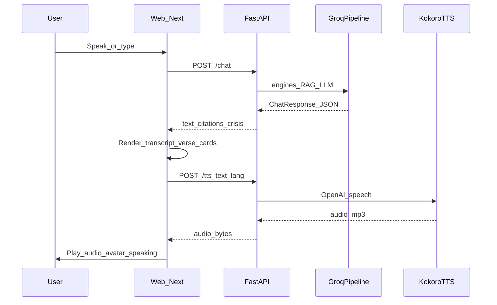

# Phase 3 — UI, Voice I/O & Kokoro (Detailed Plan)

**Scope:** A local, immersive **voice-first** surface talking to the Phase 2 brain. User types or speaks; replies return as structured chat plus cited verses; companion speech plays via Kokoro.

**Outcome:** `web/` (Next.js) on `:3000` + backend `/chat` + `/tts` + Kokoro `:8880` end-to-end on one machine. No public deploy, no auth, no PostHog.

**Depends on:** Phase 2 ([backend/conversation/schemas.py](../backend/conversation/schemas.py), [phase-2-runtime-plan.md](phase-2-runtime-plan.md)).

**Not in Phase 3:** Supabase soft auth@3, encrypted history, Vercel/Render, PostHog, fine-tune, HI crisis lexicon, Soul Graph, streaming token UI.

**Status:** Built and verified in-browser, with two known gaps (§9).

---

## 1. Locked product decisions

| Decision | Lock |
|----------|------|
| App root | `web/` (Next.js App Router, TypeScript, Tailwind) |
| Backend base | `NEXT_PUBLIC_API_URL=http://localhost:8000` |
| Chat API | Unchanged `POST /chat` from Phase 2 |
| STT | Browser **Web Speech API** only (Chrome/Edge primary) |
| TTS path | **Browser → FastAPI `/tts` → Kokoro.** Never browser→8880 |
| Voice IDs | `KOKORO_VOICE_EN=am_michael`, `KOKORO_VOICE_HI=hf_alpha`, `KOKORO_SPEED=0.9` |
| Identity copy | Never “Krishna’s real voice”; nimitta framing throughout |
| Who speaks first | **User only.** Presence waits in silence |
| Session | `session_id` per thread; full history client-held |
| Sidebar history | `localStorage` threads; title from first user message |
| Sanskrit TTS | Never spoken |
| Crisis UI | Calm steel panel, helpline **text first**, no verse cards |

---

## 2. Architecture



**Three local processes**

```bash
uvicorn backend.main:app --port 8000
```

```bash
docker compose -f docker/kokoro-compose.yml up -d
```

```bash
cd web && npm run dev
```

---

## 3. Backend additions

### 3.1 `POST /tts`

| Field | Value |
|-------|-------|
| Request | `{ "text": str, "lang": "en" \| "hi" }` |
| Response | `audio/mpeg` bytes |
| Down | `503 {"error": "tts_unavailable"}` — UI degrades to text |

`backend/voice/kokoro_client.py` also strips markdown before speaking
(`clean_for_speech`) while **preserving** spoken citations — `BG_2_47`
becomes “chapter 2, verse 47” rather than being read as an identifier.

### 3.2 Health

`GET /health` gained `kokoro_reachable` (short probe) so the UI can show
“Voice is resting” without waiting on a synthesis call.

### 3.3 Chat contract unchanged

UI maps `text` → bubble + TTS input, `verse_citations[]` → cards,
`is_crisis` → crisis chrome.

---

## 4. Frontend structure (as built)

```text
web/
  app/{layout,page}.tsx, globals.css
  components/
    PresenceAvatar.tsx    # waiting|listening|processing|speaking
    Transcript.tsx, MessageBubble.tsx, VerseCard.tsx
    Composer.tsx          # mic + lang toggle + text
    CrisisBanner.tsx, MindfulPause.tsx, SessionSidebar.tsx
  lib/
    api.ts, session.ts, speechRecognition.ts
    speechPlayback.ts, langGuess.ts
```

---

## 5. Design system

| Token | Value |
|-------|-------|
| `--bg-deep` | `#0b0906` |
| `--bg-field` | `#171208` |
| `--gold` | `#c4a35a` |
| `--ink` | `#f0e7d8` |
| `--crisis` | `#8ea0ac` (calm steel, never alarm red) |

Type: **Cormorant Garamond** display, **Source Serif 4** body — no
Inter/Roboto. Motion: idle glow, listening pulse, processing breathe;
all disabled under `prefers-reduced-motion`.

---

## 6. Key behaviours

- **Mindful pause floor (700ms).** Even when the API returns fast, the
  reply is held so the UI never snaps.
- **User speech interrupts playback.** Starting the mic stops the
  companion mid-sentence rather than talking over the user.
- **Verse cards render only from `verse_citations`** — never parsed out
  of model prose. The Phase 2 citation wall holds all the way to screen.
- **Embedder warm-up.** The embedding model loads in a daemon thread at
  startup; loading it lazily stalled the *first teaching turn* by
  seconds, and warming it inline blocked `/health`.

---

## 7. Verified in browser

| Gate | Result |
|------|--------|
| Text chat + history persists | PASS |
| Teach surface → real `BG_*` cards (2.47, 2.48) with EN translation | PASS |
| Teach gate: turns 1–2 question only, no verse | PASS |
| Crisis L4 → helpline text + banner, no verse card | PASS |
| User-first: no assistant monologue on empty load | PASS |
| TTS down → “Voice is resting”, text unaffected | PASS |
| Identity: no “I am Lord Krishna” / “real voice” copy | PASS |
| Console errors | None (503s are the expected TTS probe) |

---

## 8. Known gaps

- **Avatar art is unfinished.** The state machine works; the SVG itself
  reads as a blob rather than “a real presence”. Recommend a symbolic
  flute + peacock-feather emblem over a figurative silhouette — a badly
  drawn figure is worse than none, and a symbol also sidesteps the
  impersonation the constitution refuses.
- **Flute audio cue not shipped** (`public/audio/flute-soft.mp3` not
  sourced). Mute toggle exists and works.
- **Kokoro never exercised end-to-end** — Docker is not installed on
  this machine, so only the degrade path has been proven. The synthesis
  path is written but unverified.
- Mobile polish pass not done.
- STT verified as present/supported, not exercised with a real mic.

---

## 9. Handoff to Phase 4

Phase 4 consumes the same `web/` UI and adds: soft auth after N
messages, `localStorage` threads → Supabase (encrypted), deploy
(Next→Vercel, API→Render, Kokoro as its own container), and PostHog
**metadata-only** events — never raw crisis text.

Phase 3 deliberately leaves history browser-local so Phase 4 has a clean
persistence boundary.

---

## 10. Absolute rules

1. User speaks first
2. STT browser-only; TTS via FastAPI proxy
3. Never weaken the crisis path — text always primary
4. Verse UI only from `verse_citations`
5. Free stack; no paid voice SaaS
6. No auth/analytics wired yet
7. CORS expects `http://localhost:3000`
