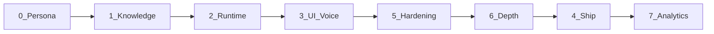

# Krishna AI — Phase roadmap

**Build order is deliberately not numeric.** Quality comes before ship, and
analytics comes last:

```text
0 → 1 → 2 → 3 → 5 → 6 → 4 → 7
```

Phase 4 (auth + deploy) is held until the companion is actually good, because
shipping a shallow English-only companion to real people at 2am is worse than
not shipping. Phase 7 (analytics) is held until there are users to measure.



| Phase | Scope | Status |
|-------|-------|--------|
| **0** | Persona constitution, behaviour matrix, example dialogues, eval suite | Done |
| **1** | Knowledge base: 700-verse spine, 66 tier-A, taxonomy, chunks, allowlist | Done — `validate_kb.py` PASS |
| **2** | Runtime brain: engines, hybrid RAG, citation wall, `POST /chat` | Done — 5/5 smoke |
| **3** | Next.js voice-first UI, `POST /tts`, Kokoro + browser TTS fallback | Done — avatar art unfinished |
| **5** | Hardening: HI/Hinglish crisis + emotion, tier-A HI, contested care, depth prompts | Done — 12/12 smoke |
| **6** | Depth: knot memory, teach arc, smarter engines, eval harness, LoRA skipped | Done — 14/14 scored eval |
| **4** | Ship: Supabase soft auth, encrypted history, Vercel + Render deploy | Blocked on 6 manual gates |
| **7** | Analytics: PostHog metadata-only, Power BI dashboards | Blocked on 4 |

---

## Why this order

**5 before 4** — after Phase 3 the product worked but felt like "a soft English
chatbot that quotes 2.47 at you". Two concrete failures drove Phase 5:

1. Crisis detection was **English-only regex**. A user typing
   *"aaj raat main jaan de dunga"* would not have been routed to help. That is
   the single most dangerous gap in the product, and it is not acceptable to
   ship past it.
2. Replies were generically warm rather than specific — the failure mode the
   north star explicitly rejects.

**6 before 4** — depth (knot memory across turns, multi-beat teaching) is what
separates "a chatbot with a Krishna costume" from the thing described in the
product doc. Shipping first would mean shipping the costume.

**7 last** — no users, nothing to measure. Analytics SDKs also touch the most
sensitive data in the product, so they wait until the encryption boundary
(Phase 4) exists.

---

## Invariants across every phase

1. Crisis detector runs first, before any other engine or the LLM.
2. L3/L4 crisis returns a **fixed, vetted string** — no model involvement.
3. Citations come only from the allowlist ∩ what was retrieved this turn.
4. The companion is a **nimitta / digital sevak** — never Sri Krishna, never God,
   never a therapist.
5. No raw conversation text leaves the machine to third parties.
6. Free stack.

---

## Phase docs

- [phase-0-persona-plan.md](phase-0-persona-plan.md)
- [phase-1-knowledge-plan.md](phase-1-knowledge-plan.md)
- [phase-2-runtime-plan.md](phase-2-runtime-plan.md)
- [phase-3-ui-voice-plan.md](phase-3-ui-voice-plan.md)
- [phase-5-hardening-plan.md](phase-5-hardening-plan.md)
- [phase-6-depth-plan.md](phase-6-depth-plan.md)
